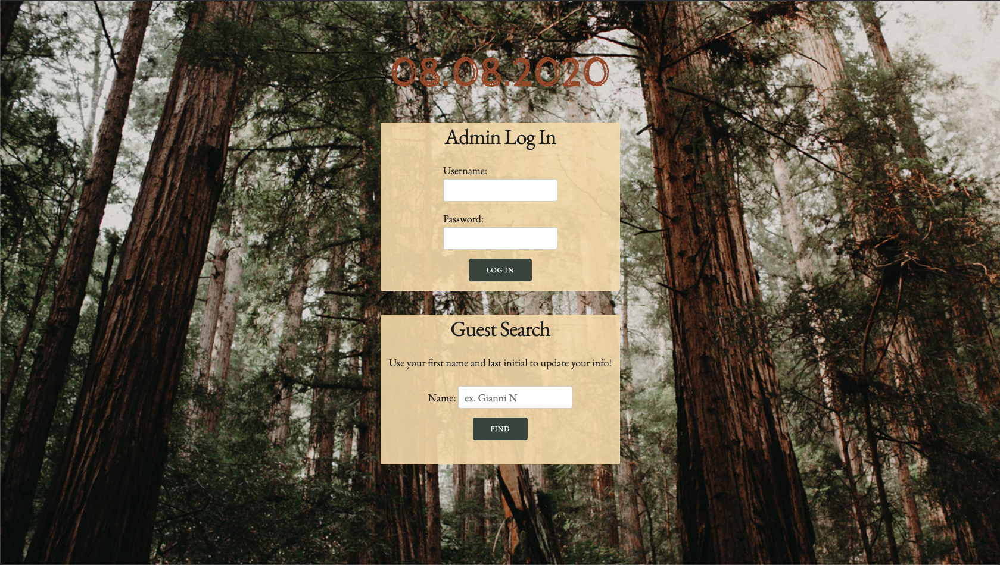

# Wedding Planner
[Wedding Planner](https://weddingguestlist.herokuapp.com/)

Tech Used: HTML / CSS / Skeleton CSS / JavaScript / Node.js / MongoDB/Mongoose / Express / EJS / Express Sessions & bcrypt

Author: Gianni Nola

## About the App
Planning a wedding is tough enough as it is so I wanted to create a website that allowed the admins (those planning the wedding) to have an interactive site that they can use to keep track of things such as guests and their info, RSVPs, invitations and what services are paid for or not. Utilizing a website like this gives you an advantage to keep all information needed in one location rather than scattered among various other apps. As an additional feature guests are able to access their information and change it to keep it up to date as they see fit. This allows for less work on the end of the bride and groom. [Full Disclosure: I knew nothing about similar websites like the Knot when I built this.]

## Navigating the App
From the homepage users are able to sign up and log in as an admin or search for themselves as a guest.

When logged in as an admin, users are able to view all the pages (rsvps, invites and budget) and add/update guest and budget info accordingly. On the RSVP page, each guest is sorted in a list according to 'Going', 'Not Going' or 'Undecided' while on the invitation page guests are sorted according to whether or not they have been sent an invitation. Depending on the info of the guests, these lists will update and sort accordingly. For convenience there is even a guest count built in that counts all guests including their plus ones. There is also a budget page that deciphers whether or not services have been paid, along with a running total of costs. (NOTE: The 'Sign Up' function was utilized then removed for project purposes.)

Admins can add guests/budget items by using the 'Create New' button or the 'Quick Add' section and delete a guest simply by clicking the delete button on the specified guest/budget item.

Clicking on each guest/budget item allows the user to either view or edit information as they see fit.

As a guest, users are able to access and edit their information such as RSVP, email and address simply by searching their name at the homepage and are only able to view and edit their own information and are unaware of any other aspects of the website that are confined to the admins.

## Behind the Scenes
Quick Add Function:

Added a quick add function to quickly add guests or items

Search Route:

Used a search route to keep guests away from admin access but edit info across the entire platform

Guest Count Partial:

Created a partial to deal with all the JS used to decipher the counts of guests according to their RSVP and plus ones

First Run Design:

## Recap
While useful for the basics of wedding planning such as a guest list and budget there are still some aspects that need to be added in order for this to be as functional as other wedding websites. Improvements include but are not limited to registry connection and personal preference of design features like the background of the homepage and title of the site. This specific app was built in order to help my fiancé and I plan our personal wedding so some aspects are personal and would need to be available to be edited according to other users.
